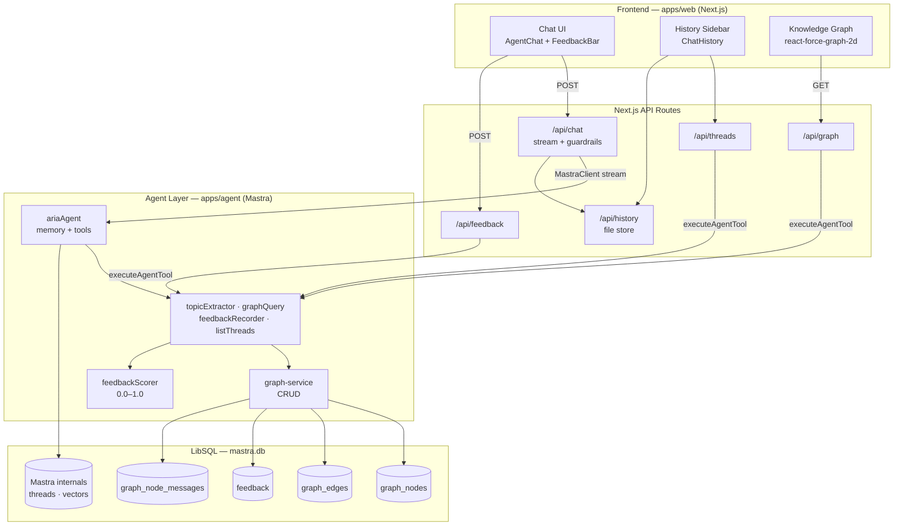
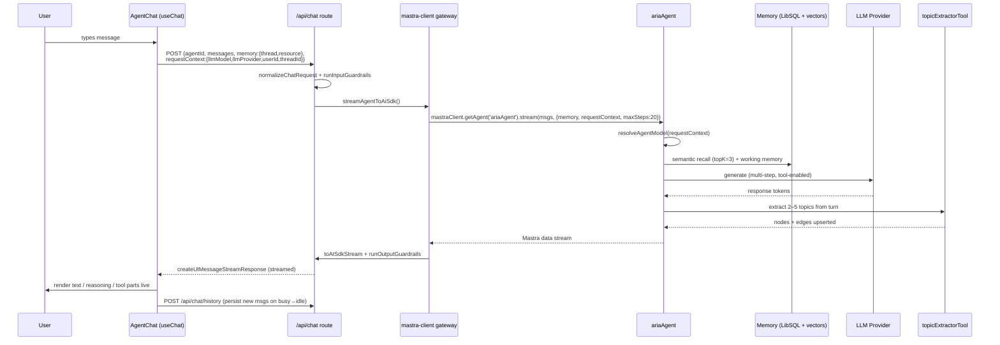
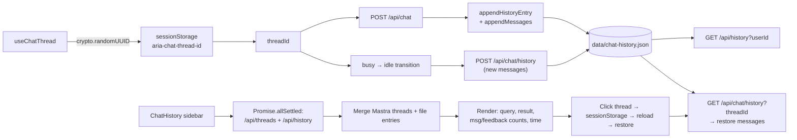
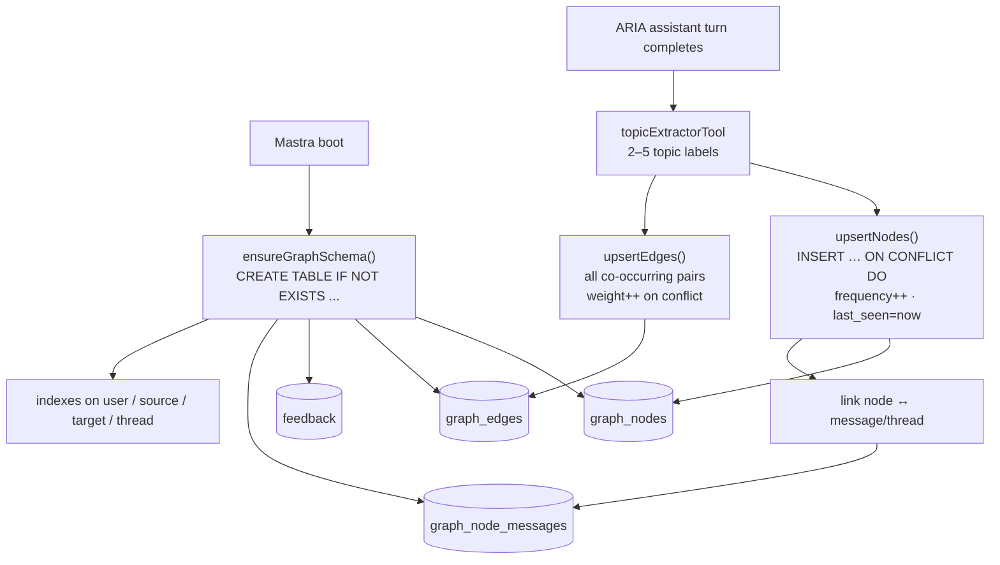
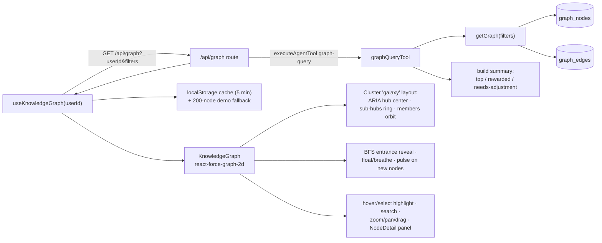
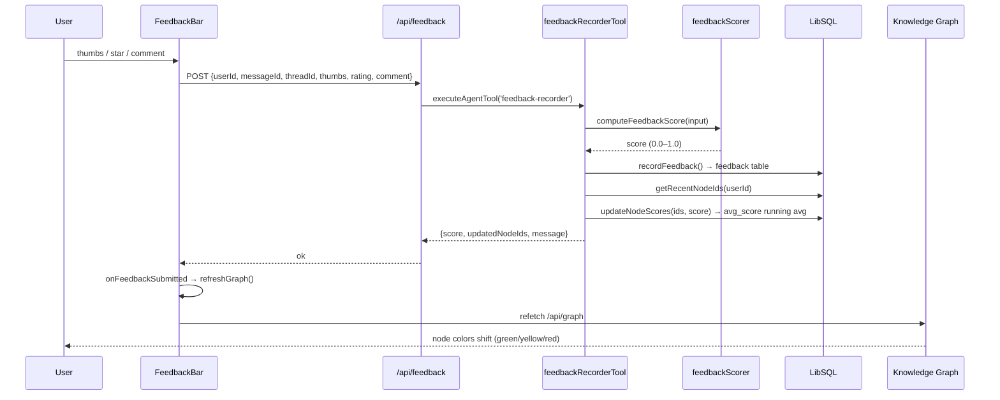
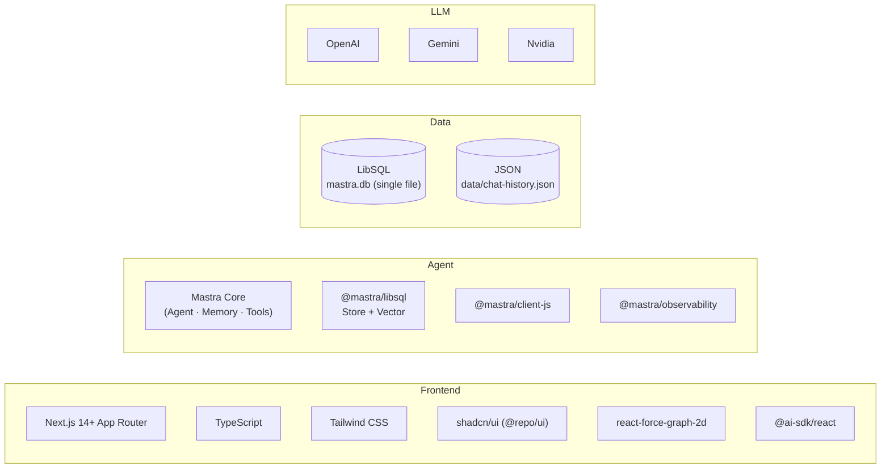

# ARIA — MVP Progress Report

> **Project:** Adaptive Reinforcement Intelligence Agent (ARIA)
> **Student:** Pradeep Kumar · **Roll No:** P2MCA24074030
> **Project Code:** 21CSA699A · MCA – Artificial Intelligence, Amrita AHEAD
> **Document type:** Progress summary of what has been achieved so far (MVP)

This document records the work completed to date on ARIA, organized around the three
core capabilities that are now functioning end‑to‑end: **Chat Call**, **History Generation**,
and **Knowledge Graph Creation**, plus the supporting **Feedback Loop** that ties them together.
Each section includes a Mermaid flow chart and references to the actual implementation files.

---

## 1. Summary of Achievements

The ARIA MVP is live and working as a three‑panel workspace:

| Capability | Status | What it does |
|---|---|---|
| **Chat Call** | ✅ Done | Streams adaptive LLM responses with working + semantic memory |
| **History Generation** | ✅ Done | Persists threads and messages; sidebar lists past conversations |
| **Knowledge Graph Creation** | ✅ Done | Auto‑extracts topics per turn and renders a live force‑directed graph |
| **Feedback Loop** | ✅ Done | Thumbs / star / comment feedback updates graph node scores |
| **Model Picker** | ✅ Done | Switch LLM providers (OpenAI / Gemini / Nvidia) at runtime |
| **Memory Layer** | ✅ Done | Working memory, semantic recall (top‑3), observational memory |
| **Analytics Dashboard** | ⬜ Phase 2 | Score‑trend charts (planned) |
| **FastAPI NLP/RL service** | ⬜ Phase 2 | Sentiment + RLHF prototype (planned) |

All data lives in a single local `mastra.db` (LibSQL) file — zero external database
infrastructure required for the MVP.

---

## 2. Overall Architecture (as implemented)



---

## 3. Chat Call — Adaptive Conversation Flow

**What was achieved:** A fully streaming chat where the ARIA agent recalls semantically
similar past messages, maintains a working‑memory user profile, dynamically picks the LLM
provider/model chosen in the UI, and calls tools mid‑conversation to build the graph.

### Flow chart



### Key implementation references

| Concern | Location |
|---|---|
| ARIA agent definition (instructions, memory, tools, dynamic model) | `apps/agent/src/mastra/agents/aria-agent.ts:15` |
| Mastra instance + tool registration + schema bootstrap | `apps/agent/src/mastra/index.ts:23` |
| Dynamic provider/model resolution | `apps/agent/src/mastra/config/model-providers.ts` |
| LibSQL storage + vector + embedder | `apps/agent/src/mastra/storage.ts:6` |
| Chat API route (normalize → guardrail → stream → persist) | `apps/web/app/api/chat/route.ts:20` |
| Mastra gateway + AI‑SDK stream conversion + output guardrails | `apps/web/lib/mastra-client.ts:113` |
| Chat UI (useChat, transport, tool/reasoning rendering) | `packages/ai-ui/src/components/llm/agent-chat.tsx:262` |
| Split‑screen workspace (history · chat · graph) | `apps/web/app/page.tsx:340` |

**Memory configuration:** `lastMessages: 20`, `semanticRecall: { topK: 3, messageRange: 1 }`,
`workingMemory` (User Knowledge Profile template), and `observationalMemory` —
all wired in `aria-agent.ts:28`.

---

## 4. History Generation — Threads & Conversation Persistence

**What was achieved:** Every conversation gets a stable thread ID. Messages and thread
metadata are persisted so the sidebar can list past chats with their first query, last
result, message/feedback counts, and relative timestamps. Reopening a thread restores
its messages.

### Flow chart



### Key implementation references

| Concern | Location |
|---|---|
| Thread ID generation + session persistence | `packages/ai-ui/src/hooks/use-chat-thread.ts:7` |
| File‑based history store (appendEntry, appendMessages, getThreadMessages) | `apps/web/lib/chat-history-store.ts:62` |
| History list API (GET) + write API (POST) | `apps/web/app/api/history/route.ts:10` |
| Per‑thread message restore API | `apps/web/app/api/chat/history/` |
| `listThreadsTool` (threads + message/feedback counts + topics via graph join) | `apps/agent/src/mastra/tools/list-threads.ts:6` |
| Threads API route | `apps/web/app/api/threads/route.ts:19` |
| History sidebar (merge Mastra + file, relative time, new/select/refresh) | `packages/ai-ui/src/components/history/ChatHistory.tsx:85` |
| Auto‑persist of new messages after each exchange | `packages/ai-ui/src/components/llm/agent-chat.tsx:278` |

**Design note:** History uses a hybrid of two sources — the Mastra `listThreadsTool`
(graph‑backed, gives topics + counts) and a JSON file store (`data/chat-history.json`,
gives `lastQuery`/`lastResult` text). `ChatHistory` merges both so the sidebar always has
a preview even when one source is empty.

---

## 5. Knowledge Graph Creation — Auto‑Built & Visualized

**What was achieved:** A personal knowledge graph that grows automatically from chat.
After every assistant turn, 2–5 topic nodes are upserted (frequency incremented), edges
between co‑occurring topics are strengthened, and the graph is linked back to the
originating message. A force‑directed "galaxy" visualization renders it live with
type‑colored nodes, BFS entrance reveal, node‑pulse on new topics, hover/selection
highlighting, search, zoom/pan/drag, and a node detail panel.

### 5.1 Graph build flow



### 5.2 Graph read + render flow



### Key implementation references

| Concern | Location |
|---|---|
| Graph schema (tables + indexes, idempotent init) | `apps/agent/src/mastra/db/schema.ts:3` |
| Graph CRUD service (upsertNodes/Edges, getGraph, score updates) | `apps/agent/src/mastra/db/graph-service.ts:105` |
| Topic extractor tool (persists 2–5 topics + co‑occurrence edges) | `apps/agent/src/mastra/tools/topic-extractor.ts:20` |
| Graph query tool (reads graph + builds adaptive summary) | `apps/agent/src/mastra/tools/graph-query.ts:5` |
| Graph API route (filters: minScore, since, nodeType, limit) | `apps/web/app/api/graph/route.ts:30` |
| Graph data hook (fetch, cache, demo, client filters) | `packages/ai-ui/src/hooks/use-knowledge-graph.ts:335` |
| Force‑directed visualization + cluster forces + canvas rendering | `packages/ai-ui/src/components/graph/KnowledgeGraph.tsx:330` |
| Graph controls (search, score/freq filters, node type, zoom, physics) | `packages/ai-ui/src/components/graph/GraphControls.tsx` |
| Node detail side panel | `packages/ai-ui/src/components/graph/NodeDetail.tsx` |

**Node visual mapping:** size ∝ `frequency`, color by `nodeType`
(system/topic/entity/concept/preference/feature), glow on hub/sub‑hub/selected/pulsing
nodes, curved bezier edges with directional arrows whose thickness ∝ `weight`.

---

## 6. Feedback Loop — Score‑Driven Adaptation

**What was achieved:** Each assistant message shows a `FeedbackBar`
(thumbs up/down · 1–5 stars · optional comment). Submission computes a 0.0–1.0 reward,
records it in the `feedback` table, and recalculates `avg_score` on the graph nodes
linked to the recent turn. The graph refreshes so node coloring reflects the new score,
and the agent is instructed to treat high‑score topics as working patterns and low‑score
topics as needing a different approach.

### Flow chart



### Key implementation references

| Concern | Location |
|---|---|
| Feedback scoring formula (thumbs base + rating norm + comment bonus) | `apps/agent/src/mastra/scorers/feedback-scorer.ts:11` |
| Feedback recorder tool (record + update node scores) | `apps/agent/src/mastra/tools/feedback-recorder.ts:18` |
| Feedback API route | `apps/web/app/api/feedback/route.ts:17` |
| FeedbackBar UI (thumbs / star / comment / submit states) | `packages/ai-ui/src/components/chat/FeedbackBar.tsx:22` |
| Graph refresh on feedback + history feedbackCount++ | `apps/web/app/page.tsx:126` |

**Scoring rule:** thumbs up → 0.85, thumbs down → 0.15, neutral → 0.5; if a star rating
is present it is normalized (/5) and averaged with the thumbs score; a comment ≥ 12 chars
adds a 0.05 bonus (capped at 1.0).

---

## 7. Tech Stack Used (implemented)



- **Monorepo:** Turborepo + pnpm — `apps/{web,agent,docs}`, `packages/{ui,ai-ui,eslint-config,typescript-config}`
- **Single‑file DB:** `mastra.db` holds Mastra internals, vectors, and all four graph/feedback tables — no Supabase needed for MVP.
- **Observability:** `MastraStorageExporter` + `MastraPlatformExporter` + `SensitiveDataFilter`, `PinoLogger`.

---

## 8. Verification Plan

The repo exposes these task commands (run from the root):

```bash
pnpm check-types     # turbo run check-types — TypeScript compilation across workspaces
pnpm lint            # turbo run lint
pnpm build           # turbo run build — full build verification
pnpm dev:web+agent   # start Next.js (:3000) + Mastra dev server (:4111) together
```

### Manual test matrix (MVP)

| Test | Expected result |
|---|---|
| Send a chat message | Streamed response + tool‑part UI + 2–5 topics extracted |
| Switch LLM in the picker | Next response uses the selected provider/model |
| Send related messages | Existing node `frequency` grows; edges strengthen |
| Submit 👍 | Node `avg_score` rises → graph leans greener |
| Submit 👎 | Node `avg_score` falls → graph leans redder |
| Open the graph expand overlay | Full‑screen galaxy graph with controls |
| Search in graph | Matching nodes highlighted, others dimmed |
| Click a node | NodeDetail panel with related nodes |
| Reload the page | Thread + messages restored from history; graph persists from LibSQL |
| Click a past thread in sidebar | That conversation loads in the chat panel |

---

## 9. What's Next (Phase 2)

1. **Analytics dashboard** — Recharts score‑trend line, acceptance rate, semantic‑recall hit rate, graph growth timeline (`apps/web/app/dashboard/`).
2. **FastAPI NLP microservice** — sentiment on feedback text, intent classification (`apps/api/`).
3. **RLHF prototype** — TRL/PPO fine‑tune on scored (query, response) pairs.
4. **Supabase (optional)** — auth + multi‑device cloud sync once multi‑user is needed.
5. **Realtime graph updates** — WebSocket push instead of refetch on feedback.

---

> **Status:** Chat Call, History Generation, and Knowledge Graph Creation are complete and
> working end‑to‑end in the MVP. The feedback loop closes the adaptive cycle: every rated
> answer visibly reshapes the knowledge graph that informs the next answer.
