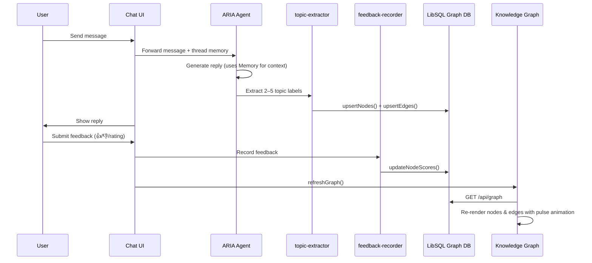
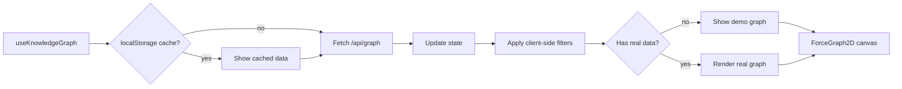

# ARIA Knowledge Graph

## 1. Overview

The ARIA Knowledge Graph is a living, feedback-tuned visualization of topics that emerge from user conversations. It is displayed on the home page alongside the chat panel and evolves automatically as the user chats and rates answers.

The visual design draws inspiration from **GitNexus** — a dark "void" aesthetic, type-based color palette, curved edges, monospace labels, and purple accent glows.

### Core concepts

| Visual cue          | Meaning                                      |
| ------------------- | -------------------------------------------- |
| Node size           | Topic frequency (log-scaled)                 |
| Node color          | Node type (system, topic, entity, concept, preference, feature) |
| Edge thickness      | Co-occurrence weight between topics          |
| Edge curve          | Curved quadratic bezier — reduces visual clutter |
| Pulse ring          | Newly discovered topic (cyan glow, 1.8s)     |
| Selection glow      | Purple accent ring on selected node + brightened neighbors |

### Key UX

- **Split view**: chat on the left (60%), history sidebar (20%), graph on the right (20%).
- **Expand graph**: fullscreen dark overlay with the graph at full width.
- **Interactive controls**: search, score filter, frequency filter, node-type filter, physics sliders, demo-mode toggle.
- **Click a node**: dark detail panel with frequency, score, last active date, and connected topics.
- **Demo mode toggle**: flask icon — loads 50+ nodes with realistic clustering for exploration.

---

## 2. High-level architecture

```mermaid
flowchart TD
    User[User sends message] --> Chat[AgentChat component]
    Chat --> Agent[ARIA Mastra Agent]
    Agent --> TopicExtractor[topic-extractor tool]
    TopicExtractor --> GraphService[graph-service.ts<br/>LibSQL DB]
    User --> Feedback[Feedback buttons]
    Feedback --> FeedbackRecorder[feedback-recorder tool]
    FeedbackRecorder --> GraphService
    GraphService --> GraphAPI[/api/graph]
    GraphAPI --> Hook[useKnowledgeGraph hook]
    Hook --> KG[KnowledgeGraph component]
    KG --> Canvas[react-force-graph-2d canvas]
```

---

## 3. Folder architecture

```text
apps/
├── web/
│   ├── app/
│   │   ├── page.tsx                   # Home layout, graph expand/collapse, demo mode state
│   │   └── api/
│   │       ├── graph/route.ts         # GET /api/graph proxy to Mastra agent tool
│   │       ├── chat/route.ts          # POST /api/chat — streams via Mastra
│   │       └── chat/history/route.ts  # GET/POST — chat message history persistence
│   ├── lib/
│   │   └── chat-history-store.ts      # File-based JSON store for threads + messages
│   └── docs/
│       └── knowledge-graph.md         # This document
├── packages/
│   └── ai-ui/
│       └── src/
│           ├── components/graph/
│           │   ├── KnowledgeGraph.tsx     # ForceGraph2D renderer + dark-theme canvas
│           │   ├── GraphControls.tsx      # Dark-themed search, filters, physics, demo toggle
│           │   ├── NodeDetail.tsx         # Dark-themed node detail panel
│           │   └── renderers/
│           │       ├── types.ts           # GraphRendererProps/Ref pluggable interface
│           │       └── SigmaRenderer.tsx  # Skeleton for sigma.js migration
│           └── hooks/
│               └── use-knowledge-graph.ts # Fetching, caching, demo data generator
└── apps/agent/
    └── src/mastra/
        ├── tools/
        │   ├── graph-query.ts        # Reads graph snapshot from DB
        │   ├── topic-extractor.ts    # Persists topics after each assistant turn
        │   └── feedback-recorder.ts  # Updates node scores from user feedback
        └── db/
            └── graph-service.ts      # LibSQL schema + CRUD operations
```

---

## 4. Data model

### GraphNode

```ts
type GraphNode = {
  id: string;           // `${userId}:${slugify(label)}`
  label: string;        // Human-readable topic name
  nodeType: string;     // system | topic | entity | concept | preference | feature
  frequency: number;    // How many times the topic appeared
  avgScore: number;     // Normalized feedback score (0–1)
  lastSeen: string;     // ISO timestamp
  val?: number;         // Force-simulation value (derived from frequency)
  color?: string;       // Explicit override color (e.g. ARIA hub — cyan)
};
```

### GraphEdge

```ts
type GraphEdge = {
  id: string;           // `${leftId}:${rightId}:${edgeType}`
  sourceId: string;
  targetId: string;
  weight: number;       // Co-occurrence count
  edgeType: string;     // e.g. co_occurrence
  source?: string;      // Resolved by renderer
  target?: string;
  value?: number;       // Alias for weight used by renderer
};
```

### Node-type → color mapping (GitNexus-inspired)

| Node type    | Color     | Hex       | Visual role                    |
| ------------ | --------- | --------- | ------------------------------ |
| `system`     | Cyan      | `#22d3ee` | ARIA hub — always present      |
| `topic`      | Purple    | `#a855f7` | Primary conversation topics    |
| `entity`     | Emerald   | `#10b981` | Named tools, platforms, people |
| `concept`    | Blue      | `#3b82f6` | Abstract ideas, patterns       |
| `preference` | Amber     | `#f59e0b` | User behavior signals          |
| `feature`    | Pink      | `#ec4899` | System capabilities            |
| (default)    | Slate     | `#64748b` | Unknown / fallback             |

---

## 5. Flow charts

### User conversation flow



### Graph refresh flow



---

## 6. Visual design system

### Dark theme tokens

| Token              | Hex       | Usage                                     |
| ------------------ | --------- | ----------------------------------------- |
| `bg-void`          | `#06060a` | Canvas background                         |
| `bg-deep`          | `#0a0a10` | Container backgrounds                     |
| `bg-surface`       | `#101018` | Control panels, cards                     |
| `bg-elevated`      | `#16161f` | Inputs, selects                           |
| `border-subtle`    | `#1e1e2a` | Dashed borders on panels                  |
| `border-default`   | `#2a2a3a` | Solid borders                             |
| `text-primary`     | `#e4e4ed` | Labels, headings                          |
| `text-secondary`   | `#8888a0` | Descriptions, values                      |
| `text-muted`       | `#5a5a70` | Placeholders, hints                       |
| `accent`           | `#7c3aed` | Active states, selection glow, buttons    |
| `accent-dim`       | `#5b21b6` | Gradient stops                            |

### Background

- Canvas: pure `#06060a` with a **radial purple gradient** rendered each frame via `onRenderFramePre`.
  ```
  radial-gradient(circle at center, rgba(124, 58, 237, 0.04), #06060a)
  ```
- No grid pattern — clean, atmospheric glow.

### Node rendering

- **Shape**: Always perfect circles with a 3D sphere effect (radial gradient highlight offset top-left).
- **Radius formula**: `radius = 3.0 * sizeMultiplier * (1 + log2(frequency + 1) * 0.45)`, clamped to **2.0–15 px**.
- **Color**: Derived from `nodeType` via the 6-color palette. Explicit `node.color` overrides when set (e.g. ARIA hub).
- **Score indication**: Shown in the `NodeDetail` panel, not baked into node color. This keeps the type-color mapping consistent.
- **Glow**: Selected nodes get a purple accent glow (`#7c3aed`, radius 2.2×, alpha 0.22).
- **Pulse**: New nodes glow cyan for 1.8s at 30% increased radius.

#### Node opacity by selection state

| State            | Selected node | Connected neighbor | Unrelated node |
| ---------------- | ------------- | ------------------ | -------------- |
| No selection     | 1.0           | 1.0                | 1.0            |
| Node selected    | 1.0 (1.8×)   | 1.0 (1.3×)         | 0.18 (0.65×)   |
| Node hovered     | 1.0 (1.4×)   | 1.0 (1.1×)         | 0.25 (0.7×)    |

### Link rendering

- **Shape**: Curved quadratic bezier. Midpoint offset perpendicular to the source-target vector.
- **Curvature**: Deterministic per-link via ID hash — `0.14 + (seed % 10) * 0.012` with alternating direction.
- **Width formula**: `min(2.8, 0.4 + log(weight + 1) * 0.35)`.
- **Color**: Default `rgba(148, 163, 184, <opacity>)`. Connected-to-selected links use purple `rgba(124, 58, 237, <opacity>)`.
- **Opacity**: 0.08–0.4 based on weight. Selected links → 0.9; unrelated → 0.04.

### Label rendering

- **Font**: `500 11px "JetBrains Mono", "Consolas", "Cascadia Code", monospace`.
- **Color**: `#e4e4ed` (white) on a dark pill `rgba(10, 10, 16, 0.82)` with a subtle type-colored border.
- **Visibility**: Labels show when ANY of: `isAriaHub`, `isSelected`, `globalScale > 0.7`, or `frequency >= 3`.

---

## 7. Pluggable renderer architecture

The graph renderer is abstracted behind a common interface so the rendering engine can be swapped without changing the data layer, controls, or API.

### Interface

```ts
// renderers/types.ts
type GraphRendererProps = {
  nodes: GraphNode[];
  edges: GraphEdge[];
  selectedNodeId: string | null;
  hoveredNodeId: string | null;
  physicsConfig: PhysicsConfig;
  layout: GraphLayout;
  demoMode: boolean;
  onNodeClick: (nodeId: string) => void;
  onNodeHover: (nodeId: string | null) => void;
  onBackgroundClick: () => void;
  onEngineStop: () => void;
};

type GraphRendererRef = {
  zoomIn: () => void;
  zoomOut: () => void;
  fitAll: () => void;
  centerAt: (x: number, y: number, durationMs?: number) => void;
  reheat: () => void;
};
```

### Current renderer: react-force-graph-2d

- Wraps `ForceGraph2D` from `react-force-graph-2d` (v1.29.1)
- Canvas-based rendering via d3-force simulation
- Custom `nodeCanvasObject` / `linkCanvasObject` for full visual control
- `onRenderFramePre` draws the dark background gradient each frame

### Future renderer: Sigma.js + Graphology

A skeleton is provided at `renderers/SigmaRenderer.tsx`. To activate:

```bash
pnpm add sigma graphology @sigma/edge-curve graphology-layout-forceatlas2
```

Then swap the import in `page.tsx` and implement the WebGL node/edge reducers.

---

## 8. API contract

### `GET /api/graph`

**Query parameters:**

| Parameter      | Type     | Required | Description                                      |
| -------------- | -------- | -------- | ------------------------------------------------ |
| `userId`       | string   | yes      | User identifier                                  |
| `minScore`     | number   | no       | Minimum average score (0–1)                      |
| `minFrequency` | number   | no       | Minimum topic frequency (client-side default: 1) |
| `since`        | ISO date | no       | Only nodes seen after this date                  |
| `nodeType`     | string   | no       | Filter by node type                              |
| `limit`        | number   | no       | Max nodes to return (default: 200)               |

**Response:**

```json
{
  "nodes": [ /* GraphNode[] */ ],
  "edges": [ /* GraphEdge[] */ ],
  "summary": "Top interests: ..."
}
```

### `GET /api/chat/history?threadId=xxx`

Returns past messages for a thread so the chat UI can hydrate history on mount.

**Response:**

```json
{
  "messages": [
    { "id": "msg-...", "role": "user", "content": "...", "createdAt": "..." },
    { "id": "msg-...", "role": "assistant", "content": "...", "createdAt": "..." }
  ]
}
```

---

## 9. Configuration / tuning

### Default physics

```ts
const DEFAULT_PHYSICS = {
  linkDistance: 120,
  repulsion: 180,
  nodeSize: 1.0,
};
```

| Parameter     | Range   | Step | Effect                                   |
| ------------- | ------- | ---- | ---------------------------------------- |
| Node size     | 0.4–2.5 | 0.1  | Multiplier on base node radius           |
| Link distance | 30–300  | 5    | Target spring length between linked nodes |
| Repulsion     | 20–600  | 20   | Charge strength (higher = more spread)   |

### Default filters

```ts
const DEFAULT_FILTERS = {
  minScore: 0.1,
  minFrequency: 1,
  limit: 200,
};
```

### Demo graphs

**Default (first-time users):** 3-node intro graph: ARIA, Semantic Memory, Feedback Loop.

**Expanded demo (toggle via flask icon):** 50+ nodes across 6 types with ~100 edges. Topics (20), entities (10), concepts (8), preferences (6), features (5), plus the ARIA hub. Edges are generated with realistic clustering — topics connect to related entities/concepts, entities interconnect, and features bridge to topics.

---

## 10. Caching

- Last fetched graph is cached in `localStorage` under `aria:kg:${userId}`.
- Cache TTL: 5 minutes.
- Cached data is shown immediately on mount while a fresh fetch runs in the background.
- On fetch failure, stale cache is used as a fallback.
- Demo mode data is generated client-side and not cached.

---

## 11. Building similar graph experiences — library comparison

ARIA uses **react-force-graph-2d** (Canvas). Below is a comparison of the major open-source graph visualization libraries, grouped by the kind of experience they enable.

### Quick-reference table

| Library                    | Rendering | Scale sweet spot | Learning curve | Bundle cost | Best for                                |
| -------------------------- | --------- | ---------------- | -------------- | ----------- | --------------------------------------- |
| **react-force-graph-2d**   | Canvas    | < 200 nodes      | Low            | ~120 KB     | Quick prototypes, React integration      |
| **force-graph-3d**         | WebGL     | < 500 nodes      | Low            | ~160 KB     | 3D eye-candy, spatial browsing           |
| **Sigma.js v3 + Graphology** | WebGL  | 1k–50k nodes     | Medium         | ~180 KB     | Large-scale, production-grade, fast      |
| **D3.js (force simulation)** | SVG/Canvas | < 500 nodes    | High           | ~250 KB     | Total creative control, custom visualizations |
| **Cytoscape.js**            | Canvas    | 500–5k nodes     | Medium         | ~450 KB     | Biology/bioinformatics, advanced layouts |
| **vis-network (vis.js)**   | Canvas    | < 1k nodes       | Low            | ~600 KB     | Drop-in solution, physics presets         |
| **@xyflow/react (React Flow)** | CSS/SVG | < 1k nodes   | Medium         | ~300 KB     | Node-based editors, flowchart UIs         |
| **G6 (AntV)**              | Canvas/WebGL | 1k–100k nodes | Medium       | ~800 KB     | Enterprise dashboards, Chinese ecosystem  |
| **graphviz (wasm)**        | SVG       | < 200 nodes      | Low            | ~3 MB       | Static layouts, DOT-language graphs       |

---

### Building an Obsidian Graph View clone

Obsidian's graph view is a force-directed node-link diagram rendered on HTML Canvas with these defining characteristics:

| Feature            | Obsidian implementation            | How to replicate                                   |
| ------------------ | ---------------------------------- | -------------------------------------------------- |
| **Canvas rendering** | Custom WebGL/Canvas              | Use `react-force-graph-2d` or raw Canvas + d3-force |
| **Node sizing**     | Log-scaled by link count          | `radius = base * Math.log(degree + 1)`              |
| **Node coloring**   | By folder depth                   | Map folders → hue wheel rotation                     |
| **Edge opacity**    | By link weight                    | `alpha = 0.1 + weight * 0.05`                       |
| **Labels**          | Only at close zoom                | `if (k > threshold) drawLabel()`                     |
| **Drag**            | Free + snap-to-center             | Built into d3-force drag                             |
| **Search highlight**| Flash node + dim others           | Flash via `setTimeout` / CSS animation               |
| **Physics**         | Adjustable via sliders            | Expose `forceLink.distance()`, `forceManyBody.strength()` |
| **Groups / clusters**| Colored circles on hover         | Use `onRenderFramePost` or overlay div                |

**Recommended stack for an Obsidian clone:**

```
react-force-graph-2d     →  Quickest path. Full React lifecycle + hook integration.
                              Custom nodeCanvasObject for the sphere + highlight look.
Sigma.js + Graphology    →  Better if you expect > 500 files. WebGL keeps 60fps.
                              Use nodeReducer/edgeReducer for the dim-on-focus effect.
```

---

### Building a Graphify / Recall-style concept map

Graphify and Recall (AI-powered apps) build knowledge graphs from user content with emphasis on:

| Feature             | How ARIA achieves it                                      |
| ------------------- | --------------------------------------------------------- |
| **Live graph updates** | `useEffect` detects new node IDs → triggers pulse animation |
| **Topic extraction**   | Mastra `topic-extractor` tool calls LLM to extract 2–5 labels |
| **Auto-refresh**       | `onMessagesPersisted` callback triggers `refreshGraph()`     |
| **Feedback loop**      | `feedback-recorder` updates `avgScore` in LibSQL, colors shift |
| **Demo mode**          | Client-side generator outputs 50+ nodes for preview          |
| **Physics tuning**     | `GraphControls` sliders with real-time simulation reheat     |
| **Chat integration**   | Side-by-side layout — graph reflects chat topics in real-time |

**How to build this from scratch:**

1. **Backend**: Store nodes/edges in any database (Postgres, LibSQL, SQLite). Schema:
   ```sql
   CREATE TABLE graph_nodes (id TEXT PK, label TEXT, node_type TEXT, frequency INT, avg_score REAL);
   CREATE TABLE graph_edges (id TEXT PK, source_id TEXT, target_id TEXT, weight REAL, edge_type TEXT);
   ```

2. **Topic extraction**: After each LLM response, call the same LLM with a structured prompt:
   ```
   "Extract 2–5 concise topic labels from this conversation turn. Return as JSON array."
   ```

3. **Graph API**: `GET /api/graph?userId=X` returns `{ nodes, edges }`.

4. **Frontend**: Use `react-force-graph-2d` with custom `nodeCanvasObject` for the visual style. Add a `pulseNodeIds` set + `setTimeout` for the new-node animation.

5. **Feedback → score**: On thumbs up/down, recompute `avgScore` and re-render with updated colors/opacity.

---

### Recommendations by use case

| Use case                          | Library choice                                           |
| --------------------------------- | -------------------------------------------------------- |
| **Quick prototype / hackathon**   | `react-force-graph-2d` — shipped in ARIA                 |
| **3D spatial graph**              | `force-graph-3d` — same API, three.js underneath         |
| **Large graph (500+ nodes)**      | `Sigma.js v3 + Graphology` — WebGL, ForceAtlas2 layout   |
| **Biology / pathway diagrams**    | `Cytoscape.js` — advanced layouts (CoSE, cola), compound nodes |
| **Node editor / flowchart**       | `@xyflow/react` (React Flow) — infinite canvas, edge handles |
| **Enterprise / Chinese ecosystem**| `G6` (AntV) — Canvas + WebGL, built-in minimap, tooltip   |
| **Static DOT / Graphviz graph**   | `@hpcc-js/wasm-graphviz` or `d3-graphviz`                |
| **Obsidian-style file graph**     | `react-force-graph-2d` (quick) or `Sigma.js` (scalable)  |
| **AI-powered concept map**        | `react-force-graph-2d` + LLM topic extraction — ARIA's stack |

---

### Migration path: react-force-graph-2d → Sigma.js

When the node count regularly exceeds 200 or you need advanced graph algorithms:

```bash
# 1. Install
pnpm add sigma graphology @sigma/edge-curve graphology-layout-forceatlas2

# 2. Replace renderer
#    Swap KnowledgeGraph.tsx → renderers/SigmaRenderer.tsx (skeleton provided)

# 3. Migrate step-by-step
#    - Keep useKnowledgeGraph, GraphControls, NodeDetail, /api/graph unchanged
#    - Rewrite only node/link rendering via sigma's nodeReducer/edgeReducer
#    - Replace d3-force with ForceAtlas2 layout (Web Worker)
#    - Enable WebGL for 60fps at any node count
```

**What stays the same:**
- Data model (`GraphNode`, `GraphEdge` types)
- API contract (`GET /api/graph`)
- Chat integration + feedback loop
- Control panel UI
- Caching strategy
- Demo data generator

**What changes:**
- `KnowledgeGraph.tsx` → imports `SigmaRenderer` instead of `ForceGraph2D`
- Canvas manual drawing → sigma.js declarative reducers
- d3-force → ForceAtlas2 (faster convergence, better for large graphs)

---

## 12. Running locally

```bash
# Terminal 1 — agent + web + UI packages
pnpm dev:web+agent

# Or separately
pnpm dev:agent   # Mastra agent server
pnpm dev:web     # Next.js web app
```

Open `http://localhost:3000` and start chatting. The graph panel will show the demo graph initially and populate with real topics after the first assistant response. Toggle the flask icon to explore the 50+ node demo dataset.
