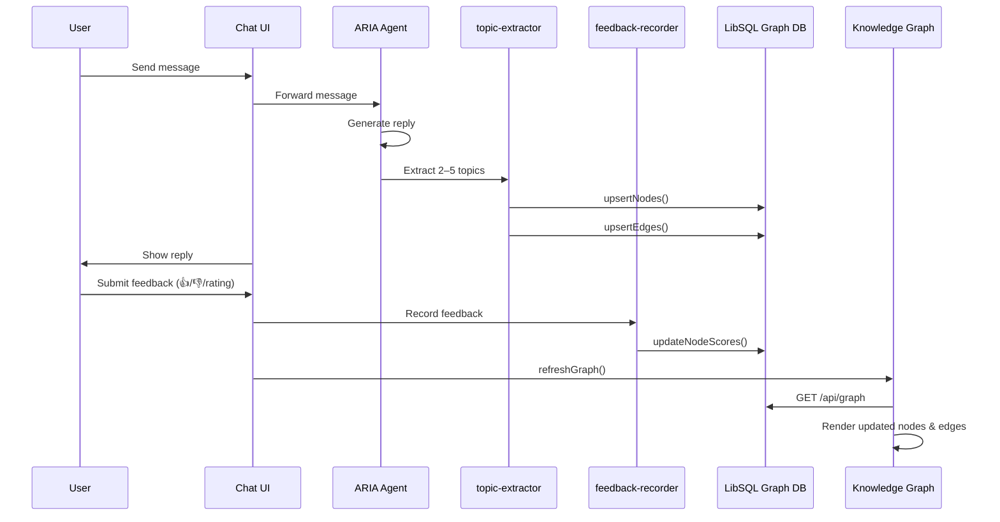
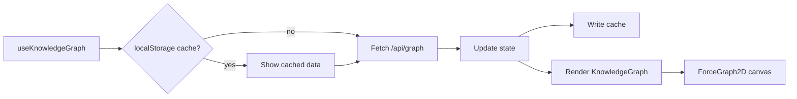

# ARIA Knowledge Graph

## 1. Overview

The ARIA Knowledge Graph is a living, feedback-tuned visualization of topics that emerge from user conversations. It is displayed on the home page alongside the chat panel and evolves automatically as the user chats and rates answers.

### Core concepts

| Visual cue          | Meaning                                      |
| ------------------- | -------------------------------------------- |
| Node size           | Topic frequency (log-scaled)                 |
| Node color          | Average feedback score (red → amber → green) |
| Edge thickness      | Co-occurrence weight between topics          |
| Pulse ring          | Newly discovered topic                       |
| Selection highlight | Focused node + its neighbors                 |

### Key UX

- **Split view**: chat on the left, graph on the right.
- **Expand graph**: fullscreen graph mode hides the chat panel and uses the full content width.
- **Interactive controls**: search, score filter, frequency filter, node-type filter, physics tuning.
- **Click a node**: opens a detail panel with frequency, score, last active date, and connected topics.

---

## 2. High-level architecture

```mermaid
flowchart TD
    User[User sends message] --> Chat[AgentChat component]
    Chat --> Agent[ARIA Mastra Agent]
    Agent --> TopicExtractor[topic-extractor tool]
    TopicExtractor --> GraphService[graph-service.ts<br/>LibSQL DB]
    User --> Feedback[Feedback buttons]
    Feedback --> FeedbackRecorder[feedback-recorder tool]
    FeedbackRecorder --> GraphService
    GraphService --> GraphAPI[/api/graph]
    GraphAPI --> Hook[useKnowledgeGraph hook]
    Hook --> KG[KnowledgeGraph component]
    KG --> Canvas[react-force-graph-2d canvas]
```

---

## 3. Folder architecture

```text
apps/
├── web/
│   ├── app/
│   │   ├── page.tsx                 # Home layout, graph expand/collapse state
│   │   └── api/graph/route.ts       # GET /api/graph proxy to Mastra agent tool
│   ├── lib/
│   │   └── chat-history-store.ts    # Local JSON chat history store
│   └── docs/
│       └── knowledge-graph.md       # This document
├── packages/
│   └── ai-ui/
│       └── src/
│           ├── components/graph/
│           │   ├── KnowledgeGraph.tsx   # ForceGraph2D renderer + interactions
│           │   ├── GraphControls.tsx    # Search, filters, physics sliders
│           │   └── NodeDetail.tsx       # Selected node detail panel
│           └── hooks/
│               └── use-knowledge-graph.ts   # Fetching, caching, demo graph
└── apps/agent/
    └── src/mastra/
        ├── tools/
        │   ├── graph-query.ts        # Reads graph snapshot from DB
        │   ├── topic-extractor.ts    # Persists topics after each assistant turn
        │   └── feedback-recorder.ts  # Updates node scores from user feedback
        └── db/
            └── graph-service.ts      # LibSQL schema + CRUD operations
```

---

## 4. Data model

### GraphNode

```ts
type GraphNode = {
  id: string; // `${userId}:${slugify(label)}`
  label: string; // Human-readable topic name
  nodeType: string; // topic | entity | concept | preference | system
  frequency: number; // How many times the topic appeared
  avgScore: number; // Normalized feedback score (0–1)
  lastSeen: string; // ISO timestamp
  val?: number; // Force-simulation value (derived from frequency)
  color?: string; // Explicit override color (e.g. ARIA hub)
};
```

### GraphEdge

```ts
type GraphEdge = {
  id: string; // `${leftId}:${rightId}:${edgeType}`
  sourceId: string;
  targetId: string;
  weight: number; // Co-occurrence count
  edgeType: string; // e.g. co_occurrence
  source?: string; // Resolved by renderer
  target?: string;
  value?: number; // Alias for weight used by renderer
};
```

### Score-to-color mapping

| Score range | Color                                    |
| ----------- | ---------------------------------------- |
| 0.0 – 0.4   | Red gradient (#ef4444 → #eab308)         |
| 0.4 – 1.0   | Amber-green gradient (#eab308 → #22c55e) |

---

## 5. Flow chart

### User conversation flow



### Graph refresh flow



---

## 6. Visual design system

### Node rendering

- Base radius: `2.8px`
- Min radius: `2.5px`
- Max radius: `11px`
- Formula: `radius = 2.8 * sizeMultiplier * (1 + log2(frequency + 1) * 0.42)`
- Selected nodes get a white border and soft radial glow.
- Pulsing nodes temporarily grow to `1.25×` radius with an outer glow.

### Link rendering

- Base opacity: `0.12`
- Opacity increases with weight up to `0.4`
- Width formula: `min(2.2, 0.35 + log(weight + 1) * 0.32)`
- Selected/hovered links become fully opaque; unrelated links dim.

### Labels

- Always shown for the ARIA hub node.
- Other labels appear when:
  - Zoom level > 0.85
  - Frequency ≥ 5
  - Node is selected
- Labels render inside rounded semi-transparent pills for readability.

---

## 7. API contract

### `GET /api/graph`

**Query parameters:**

| Parameter      | Type     | Required | Description                                      |
| -------------- | -------- | -------- | ------------------------------------------------ |
| `userId`       | string   | yes      | User identifier                                  |
| `minScore`     | number   | no       | Minimum average score (0–1)                      |
| `minFrequency` | number   | no       | Minimum topic frequency (client-side default: 1) |
| `since`        | ISO date | no       | Only nodes seen after this date                  |
| `nodeType`     | string   | no       | Filter by node type                              |
| `limit`        | number   | no       | Max nodes to return (default: 200)               |

**Response:**

```json
{
  "nodes": [
    /* GraphNode[] */
  ],
  "edges": [
    /* GraphEdge[] */
  ],
  "summary": "Top interests: ..."
}
```

---

## 8. Configuration / tuning

### Default physics

```ts
const DEFAULT_PHYSICS = {
  linkDistance: 120,
  repulsion: 180,
  nodeSize: 1.0,
};
```

### Default filters

```ts
const DEFAULT_FILTERS = {
  minScore: 0.1,
  minFrequency: 1,
  limit: 200,
};
```

### Demo graph

When no real data exists, a minimal 3-node demo graph is shown:

- **ARIA** (system hub, cyan)
- **Semantic Memory**
- **Feedback Loop**

---

## 9. Caching

- Last fetched graph is cached in `localStorage` under `aria:kg:${userId}`.
- Cache TTL: 5 minutes.
- Cached data is shown immediately on mount while a fresh fetch runs in the background.
- On fetch failure, stale cache is used as a fallback.

---

## 10. Known limitations & roadmap

### Current implementation

- **Renderer**: `react-force-graph-2d` (Canvas + d3-force)
- **Sweet spot**: up to ~150–200 nodes
- **Strengths**: fast to ship, custom canvas rendering, good interaction model
- **Weaknesses**: TypeScript typings can be brittle, Canvas performance degrades at larger scales

### Future migration path

- Evaluate **Sigma.js + Graphology** (`@react-sigma/core`) when:
  - Node count regularly exceeds 200
  - TypeScript maintenance becomes painful
  - Need WebGL performance or graph algorithms (shortest path, community detection)
- Migration would keep `useKnowledgeGraph`, `GraphControls`, `NodeDetail`, and `/api/graph` unchanged; only `KnowledgeGraph.tsx` would be replaced.

---

## 11. Running locally

```bash
# Terminal 1 — agent + web + UI packages
pnpm dev:web+agent

# Or separately
pnpm dev:agent   # Mastra agent server
pnpm dev:web     # Next.js web app
```

Open `http://localhost:3000` and start chatting. The graph panel will show the demo graph initially and populate with real topics after the first assistant response.
