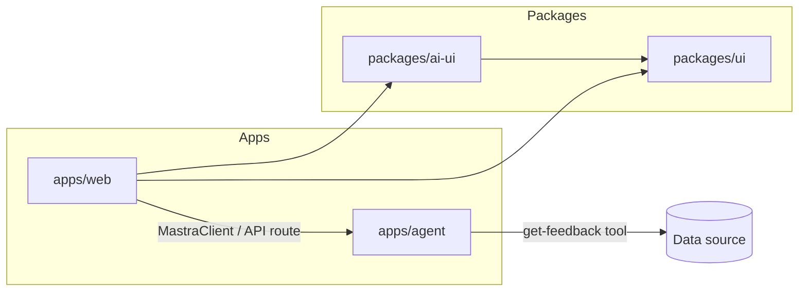

# Architecture

System-wide architecture documentation. Use this for cross-app concerns and platform integrations.

## Documents

| Document | Scope |
|----------|-------|
| [Monorepo](./monorepo.md) | Turborepo + pnpm workspace layout, apps vs packages |
| [AI Platform](./ai-platform.md) | Mastra as a separate service, how `apps/web` connects |
| [Mastra Web Connection](./mastra-web-connection.md) | `mastra-client.ts`, AI UI package layout, feedback 500 fix, phased plan |
| [Mastra Supabase Database](./mastra-supabase-database-architecture.md) | Production database setup with Supabase Postgres |

## When to add here vs `docs/features/`

| Add to `architecture/` | Add to `features/<name>/` |
|------------------------|---------------------------|
| Mastra server placement in monorepo | Customer feedback summarization UI flow |
| Auth strategy across apps | Feature-specific API routes |
| Shared database / storage choices | Tool implementation for one agent |
| Deployment topology | User-facing feature requirements |

## Diagram (target state)

