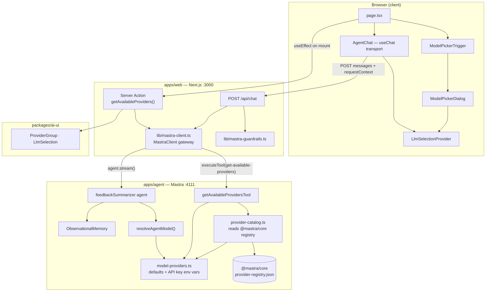
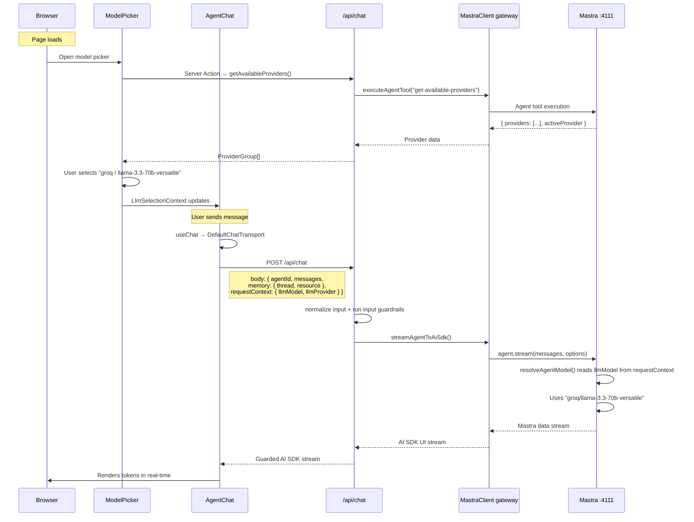
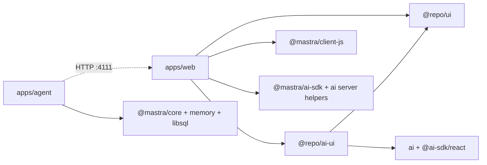

# Mastra ↔ Web Connection

How `apps/agent` (Mastra on `:4111`) connects to `apps/web` (Next.js on `:3000`), where every piece lives, and how to add the multi-provider model picker.

---

## Architecture Overview



### Provider / model discovery flow

1. **Browser** calls the server action `getAvailableProviders()` on page load.
2. **Server action** calls `fetchProviderCatalog()` in `mastra-client.ts` (single gateway).
3. **Gateway** invokes `get-available-providers` on the Mastra agent via `@mastra/client-js`.
4. **Agent tool** checks which providers have API keys set (`OPENAI_API_KEY`, `GROQ_API_KEY`, etc.).
5. **For each connected provider**, `provider-catalog.ts` reads `@mastra/core/dist/provider-registry.json`, sorts models newest-first (same heuristic as `provider-registry.mjs`), filters non-chat models, and returns up to 8 latest models. Project defaults (`agent` / `memory` roles) are always included.
6. **Server action** maps the tool response to `ProviderGroup[]` for `@repo/ai-ui` — no model list is hardcoded in the web UI.
7. **Model picker** renders grouped models; selection is stored in `localStorage` via `LlmSelectionProvider`.

### Chat streaming flow

1. **AgentChat** sends `requestContext: { llmModel, llmProvider }` with each message.
2. **`/api/chat`** normalizes the body, runs input guardrails, then calls `streamAgentToAiSdk()`.
3. **Gateway** streams from Mastra; **`resolveAgentModel()`** on the agent picks the model (`llmModel` → `llmProvider` default → env default).
4. Response is converted to AI SDK UI stream format via `@mastra/ai-sdk` and returned to the browser.

---

## Separation of Concerns

| Layer | Owns | Does NOT own |
|-------|------|--------------|
| **`apps/agent`** | Agents, tools, memory, model resolution, provider config, API keys, observability | React, UI, pages |
| **`packages/ai-ui`** (`@repo/ai-ui`) | Reusable AI UI components (chat, model picker, contexts, hooks), shared types | Server logic, Mastra SDK imports, API keys |
| **`packages/ui`** (`@repo/ui`) | Design system primitives (Button, Card, Dialog, Select), CSS tokens | AI deps, business logic |
| **`apps/web`** | Page composition, guarded API route, server actions, Mastra client gateway | Mastra agent logic, component internals |

Any future app (`apps/mobile`, `apps/admin`) imports the same `@repo/ai-ui` components and talks to the same `apps/agent` backend.

---

## Why Mastra Client Gateway

Mastra runs as a **separate backend** in `apps/agent`. The web app should not import the Mastra instance or provider keys. Instead, `apps/web` owns a small server-only gateway built around `@mastra/client-js`.

| Approach | When to use |
|----------|-------------|
| `@mastra/ai-sdk` + `handleChatStream()` | Single-app, Mastra embedded in Next.js |
| **`@mastra/client-js` gateway** (our approach) | Separate backend, monorepo, multi-app consumers |

The gateway centralizes:

- Mastra base URL and retry behavior
- Allowed agent IDs
- Tool execution
- AI SDK stream conversion
- Input and output guardrail hooks

`@mastra/ai-sdk` is still used in `apps/web`, but only as a **server-side stream adapter** (`toAISdkStream`) so `@repo/ai-ui` can keep using AI SDK UI components. The React chat hook (`@ai-sdk/react`) remains owned by `@repo/ai-ui`.

Studio is not part of the production chat path. It is a developer UI for inspecting and testing the Mastra app. The Next.js interface only needs the Mastra server URL in `MASTRA_API_URL`, and `/api/chat` forwards requests to that server-side endpoint.

---

## Environment Variables

| File | Contents | Accessed by |
|------|----------|-------------|
| `apps/agent/.env.local` | `LLM_PROVIDER`, `OPENAI_API_KEY`, `GROQ_API_KEY`, `NVIDIA_API_KEY`, `SARVAM_API_KEY`, `LLM_AGENT_MODEL` (optional override), `LLM_MEMORY_MODEL` (optional override) | Mastra agent only |
| `apps/web/.env.local` | `MASTRA_API_URL=http://localhost:4111` | Next.js server actions + API routes only |

Provider API keys **never** leave `apps/agent`. The web app only knows the Mastra server URL.

---

## Folder Structure

### `apps/agent` — Mastra Backend

```
apps/agent/
├── .env.example
├── .env.local                          # provider API keys (gitignored)
├── package.json                        # @repo/agent — mastra, @mastra/core, @mastra/memory
├── tsconfig.json                       # ES2022, moduleResolution: bundler
└── src/mastra/
    ├── index.ts                        # Mastra({ agents, tools, storage, … })
    ├── agents/
    │   └── feedback-summarizer.ts      # feedbackSummarizer agent
    ├── config/
    │   ├── model-providers.ts          # PROVIDER_MODELS, resolveAgentModel(), env key map
    │   └── provider-catalog.ts         # reads Mastra registry, getConnectedProviders()
    ├── tools/
    │   ├── get-feedback.ts             # feedback retrieval + pagination
    │   └── get-available-providers.ts  # [NEW] reports which providers have API keys
    ├── data/
    │   └── feedback.ts                 # static feedback items (demo data)
    └── public/
        └── mastra.db                   # LibSQL storage
```

### `packages/ai-ui` — Shared AI Component Library

```
packages/ai-ui/
├── package.json                        # @repo/ai-ui — ai, @ai-sdk/react, @repo/ui
├── tsconfig.json                       # extends @repo/typescript-config/react-library
├── components.json                     # shadcn/ai-elements config
└── src/
    ├── components/
    │   ├── ai-elements/                # [FUTURE] pnpm dlx ai-elements@latest
    │   └── llm/
    │       ├── agent-chat.tsx          # ✅ streaming chat — useChat + DefaultChatTransport
    │       ├── llm-selection-context.tsx  # [NEW] React context for model selection
    │       ├── model-picker-dialog.tsx    # [NEW] provider/model picker dialog
    │       └── model-picker-trigger.tsx   # [NEW] compact trigger button
    ├── hooks/
    │   └── use-chat-thread.ts          # ✅ sessionStorage-backed thread UUID
    └── lib/
        └── types.ts                    # [NEW] LlmSelection, ProviderGroup types
```

### `apps/web` — Next.js Frontend

```
apps/web/
├── .env.local                          # MASTRA_API_URL only (gitignored)
├── package.json                        # web — @mastra/client-js, @mastra/ai-sdk, ai, @repo/ai-ui, @repo/ui
├── next.config.js                      # transpilePackages: ["@repo/ui", "@repo/ai-ui"]
├── tsconfig.json                       # extends @repo/typescript-config/nextjs
├── lib/
│   ├── mastra-client.ts               # ✅ MastraClient gateway + agent registry
│   └── mastra-guardrails.ts           # ✅ input/output guardrail hooks
└── app/
    ├── layout.tsx                      # root layout — fonts, global CSS
    ├── page.tsx                        # ✅ primary chat page — AgentChat + ModelPicker
    ├── api/
    │   └── chat/
    │       └── route.ts               # ✅ guarded stream route → MastraClient
    └── llm/
        └── actions.ts                 # [NEW] server action — fetch providers from agent
```

### `packages/ui` — Design System (unchanged)

```
packages/ui/
├── package.json                        # @repo/ui — radix, cva, tailwind-merge
└── src/
    ├── components/                     # Button, Card, Dialog, Select, Table, etc.
    ├── hooks/
    ├── lib/
    └── styles/
        └── globals.css                 # design tokens + Tailwind base
```

---

## What Already Works

| Component | File | Status |
|-----------|------|--------|
| Mastra agent with memory + tools | [`feedback-summarizer.ts`](../../apps/agent/src/mastra/agents/feedback-summarizer.ts) | ✅ |
| Multi-provider model config | [`model-providers.ts`](../../apps/agent/src/mastra/config/model-providers.ts) | ✅ — supports openai, groq, nvidia, sarvam |
| Dynamic model catalog from Mastra registry | [`provider-catalog.ts`](../../apps/agent/src/mastra/config/provider-catalog.ts) | ✅ — up to 8 latest models per connected provider |
| `requestContext` dynamic model resolution | [`resolveAgentModel()`](../../apps/agent/src/mastra/config/model-providers.ts) | ✅ — per-provider; per-model override needed |
| Mastra gateway in web | [`mastra-client.ts`](../../apps/web/lib/mastra-client.ts) | ✅ — agent registry, typed client, stream adapter |
| Guardrail hooks | [`mastra-guardrails.ts`](../../apps/web/lib/mastra-guardrails.ts) | ✅ — normalizes input and provides input/output policy hooks |
| Streaming chat route | [`/api/chat/route.ts`](../../apps/web/app/api/chat/route.ts) | ✅ — validates request, calls MastraClient, returns AI SDK stream |
| `AgentChat` component | [`agent-chat.tsx`](../../packages/ai-ui/src/components/llm/agent-chat.tsx) | ✅ — `useChat`, `DefaultChatTransport`, thread memory |
| Thread memory hook | [`use-chat-thread.ts`](../../packages/ai-ui/src/hooks/use-chat-thread.ts) | ✅ — sessionStorage UUID |
| `@repo/ai-ui` package setup | [`package.json`](../../packages/ai-ui/package.json) | ✅ — exports, deps, `components.json` |
| `transpilePackages` in Next.js | [`next.config.js`](../../apps/web/next.config.js) | ✅ — `["@repo/ui", "@repo/ai-ui"]` |
| Home page with chat | [`page.tsx`](../../apps/web/app/page.tsx) | ✅ — renders `<AgentChat>` |

---

## What Needs to Be Built

### Step 1 — Cleanup: Delete dead code

The old `/feedback` page is dead code (page redirects to `/`, server action has a `threadId` bug). Delete:

- `apps/web/app/feedback/page.tsx`
- `apps/web/app/feedback/actions.ts`

### Step 2 — Shared types in `@repo/ai-ui`

Create `packages/ai-ui/src/lib/types.ts`:

```typescript
/** A user's selected provider + model pair. */
export interface LlmSelection {
  /** Provider key, e.g. "openai" */
  provider: string;
  /** Full model string, e.g. "openai/gpt-5.2" */
  model: string;
  /** Human label, e.g. "GPT-5.2" */
  displayName?: string;
}

/** A provider and its models — used to populate the picker. */
export interface ProviderGroup {
  /** Provider key, e.g. "groq" */
  provider: string;
  /** Human label, e.g. "Groq" */
  displayName: string;
  /** Whether the provider's API key is set on the agent server */
  connected: boolean;
  /** Available models for this provider */
  models: Array<{
    /** Full model string, e.g. "groq/llama-3.3-70b-versatile" */
    id: string;
    /** Display name, e.g. "Llama 3.3 70B" */
    name: string;
    /** What this model is used for */
    role: "agent" | "memory" | "both";
  }>;
}
```

### Step 3 — Agent-side: upgrade `resolveAgentModel()` + providers tool

#### 3a. Upgrade `resolveAgentModel()` in [`model-providers.ts`](../../apps/agent/src/mastra/config/model-providers.ts)

Currently reads `requestContext.get("llmProvider")` and picks the provider's default model. Upgrade to also accept a full model string via `llmModel`:

```typescript
export function resolveAgentModel(requestContext?: {
  get?: (key: string) => unknown;
}): string {
  // Priority 1 — explicit model string: "groq/llama-3.3-70b-versatile"
  const modelOverride = requestContext?.get?.("llmModel");
  if (typeof modelOverride === "string" && modelOverride.includes("/")) {
    return modelOverride;
  }

  // Priority 2 — provider selection → that provider's default agent model
  const override = requestContext?.get?.("llmProvider");
  if (typeof override === "string" && override in PROVIDER_MODELS) {
    return getAgentModel(override as LlmProvider);
  }

  // Priority 3 — env default
  return getAgentModel();
}
```

**Resolution order:** `requestContext.llmModel` → `requestContext.llmProvider` → `LLM_AGENT_MODEL` env → `PROVIDER_MODELS[LLM_PROVIDER].agent` env → `openai/gpt-5.2`.

#### 3b. Add `getConnectedProviders()` helper

```typescript
export function getConnectedProviders(): Array<{
  provider: LlmProvider;
  connected: boolean;
  models: ProviderModelConfig;
}> {
  return (Object.keys(PROVIDER_MODELS) as LlmProvider[]).map((p) => ({
    provider: p,
    connected: Boolean(process.env[PROVIDER_API_KEY_ENV[p]]),
    models: PROVIDER_MODELS[p],
  }));
}
```

#### 3c. Create provider discovery tool

New file: `apps/agent/src/mastra/tools/get-available-providers.ts`

```typescript
import { createTool } from "@mastra/core/tools";
import { z } from "zod";
import { getActiveProvider, getConnectedProviders } from "../config/model-providers";

export const getAvailableProvidersTool = createTool({
  id: "get-available-providers",
  description: "Returns the list of LLM providers configured on this agent server and their connection status.",
  inputSchema: z.object({}),
  outputSchema: z.object({
    providers: z.array(
      z.object({
        provider: z.string(),
        connected: z.boolean(),
        models: z.object({ agent: z.string(), memory: z.string() }),
      }),
    ),
    activeProvider: z.string(),
  }),
  execute: async () => ({
    providers: getConnectedProviders(),
    activeProvider: getActiveProvider(),
  }),
});
```

#### 3d. Register in Mastra instance

Update [`apps/agent/src/mastra/index.ts`](../../apps/agent/src/mastra/index.ts):

```diff
+ import { getAvailableProvidersTool } from './tools/get-available-providers';

  export const mastra = new Mastra({
    agents: { feedbackSummarizer },
+   tools: { getAvailableProvidersTool },
    ...
  });
```

And add the tool to the agent in [`feedback-summarizer.ts`](../../apps/agent/src/mastra/agents/feedback-summarizer.ts):

```diff
+ import { getAvailableProvidersTool } from '../tools/get-available-providers';

  export const feedbackSummarizer = new Agent({
    ...
-   tools: { getFeedbackTool },
+   tools: { getFeedbackTool, getAvailableProvidersTool },
    ...
  });
```

### Step 4 — `@repo/ai-ui`: Model picker components

#### 4a. `LlmSelectionProvider` — React context

New file: `packages/ai-ui/src/components/llm/llm-selection-context.tsx`

- Stores `LlmSelection | null` in React state
- Persists to `localStorage` (key: `aria-llm-selection`)
- Hydration-safe: reads localStorage in `useEffect`, not during SSR
- Exports `LlmSelectionProvider` (wrapper) and `useLlmSelection()` (hook)

```tsx
// Usage in any app
import { LlmSelectionProvider, useLlmSelection } from "@repo/ai-ui/components/llm/llm-selection-context";
```

#### 4b. `ModelPickerDialog` — provider/model picker

New file: `packages/ai-ui/src/components/llm/model-picker-dialog.tsx`

- Props: `providers: ProviderGroup[]`, `onOpenChange: (open: boolean) => void`
- Composes `@repo/ai-ui/components/ai-elements/model-selector` primitives rather than building the dialog directly from raw `@repo/ui` components
- Groups models by provider, connected providers listed first
- Disconnected providers show a "No API key" badge (still selectable, agent errors at runtime)
- Calls `useLlmSelection().setSelection()` on pick

#### 4c. `ModelPickerTrigger` — compact button

New file: `packages/ai-ui/src/components/llm/model-picker-trigger.tsx`

- Props: `providers: ProviderGroup[]`, `className?: string`
- Shows current selection: "OpenAI · gpt-5.2" or "Select model" when empty
- Click opens `ModelPickerDialog`

#### 4d. Wire `AgentChat` to selection context

Modify [`agent-chat.tsx`](../../packages/ai-ui/src/components/llm/agent-chat.tsx) to read `useLlmSelection()` and include the selection in `requestContext`:

```diff
+ import { useLlmSelection } from "./llm-selection-context";

  export function AgentChat({ ... }) {
+   const { selection } = useLlmSelection();
    const threadId = useChatThread();

    const transport = useMemo(
      () => new DefaultChatTransport({
        api: apiUrl,
        prepareSendMessagesRequest({ messages }) {
          return {
            body: {
              agentId,
              messages: lastMessage ? [lastMessage] : messages,
              memory: { thread: threadId, resource: agentId },
+             requestContext: selection
+               ? { llmModel: selection.model, llmProvider: selection.provider }
+               : undefined,
            },
          };
        },
      }),
-     [agentId, apiUrl, threadId],
+     [agentId, apiUrl, threadId, selection],
    );
```

### Step 5 — `apps/web`: Server action + page update

#### 5a. Provider discovery server action

New file: `apps/web/app/llm/actions.ts`

```typescript
"use server";

import type { ProviderGroup } from "@repo/ai-ui/lib/types";

export type AvailableProvidersResult = {
  providers: ProviderGroup[];
  activeProvider: string | null;
};

export async function getAvailableProviders(): Promise<AvailableProvidersResult> {
  const data = await executeAgentTool<ProviderToolResponse>({
    agentId: FEEDBACK_AGENT_ID,
    toolId: "get-available-providers",
    data: {},
  });

  return {
    providers: transformToProviderGroups(data),
    activeProvider: data.activeProvider ?? null,
  };
}
```

#### 5b. Update home page

Modify [`apps/web/app/page.tsx`](../../apps/web/app/page.tsx):

- Wrap in `LlmSelectionProvider`
- Add `ModelPickerTrigger` in the header
- Fetch providers on mount via `useEffect` + the server action
- If no `aria-llm-selection` value exists in `localStorage`, initialize the selection from the Mastra server's `activeProvider` (or first connected provider)
- Remove the old workspace architecture table (or keep it below the chat)

```tsx
import { AgentChat } from "@repo/ai-ui/components/llm/agent-chat";
import { LlmSelectionProvider } from "@repo/ai-ui/components/llm/llm-selection-context";
import { ModelPickerTrigger } from "@repo/ai-ui/components/llm/model-picker-trigger";
```

### Step 6 — AI Elements (implemented)

`pnpm dlx ai-elements@latest` has already been run inside `packages/ai-ui`, so `src/components/ai-elements/` is populated and ready to use.

These components now form the base reusable layer, while `src/components/llm/` contains Aria-specific wrappers that compose them:

- `components/ai-elements/*` = generic AI UI primitives
- `components/llm/*` = Mastra-aware components like `AgentChat` and `ModelPickerTrigger`

The export path exists in `package.json`:

```json
"./components/ai-elements/*": "./src/components/ai-elements/*"
```

Any app can then import:

```tsx
import { SomeElement } from "@repo/ai-ui/components/ai-elements/some-element";
```

---

## Data Flow: Streaming Chat with Model Selection



---

## Model Resolution Priority

`resolveAgentModel()` in [`model-providers.ts`](../../apps/agent/src/mastra/config/model-providers.ts) resolves which model to use at runtime:

| Priority | Source | Example | Scope |
|----------|--------|---------|-------|
| 1 | `requestContext.llmModel` | `"groq/llama-3.3-70b-versatile"` | Per request — from web model picker |
| 2 | `requestContext.llmProvider` | `"groq"` → uses groq's default agent model | Per request — provider-level pick |
| 3 | `LLM_AGENT_MODEL` env var | `"nvidia/meta/llama-3.3-70b-instruct"` | Server-wide override |
| 4 | `PROVIDER_MODELS[LLM_PROVIDER].agent` | `"openai/gpt-5.2"` (when `LLM_PROVIDER=openai`) | Server default |
| 5 | Fallback | `"openai/gpt-5.2"` | Hardcoded safe default |

### Studio vs env vs web picker

| Method | Restart needed? | Scope | Use for |
|--------|-----------------|-------|---------|
| Change `LLM_PROVIDER` in agent `.env` | Yes | Server default | Dev default provider |
| Studio model picker | No | Whole dev server memory | Agent testing in Studio |
| Web `ModelPickerDialog` | No | Per user session (localStorage) | Production + web UX |
| `requestContext` on API call | No | Per request | Programmatic overrides |

---

## Supported Providers

Defined in [`model-providers.ts`](../../apps/agent/src/mastra/config/model-providers.ts):

| Provider | Agent Model | Memory Model | API Key Env |
|----------|-------------|--------------|-------------|
| `openai` | `openai/gpt-5.2` | `openai/gpt-5-mini` | `OPENAI_API_KEY` |
| `groq` | `groq/llama-3.3-70b-versatile` | `groq/llama-3.1-8b-instant` | `GROQ_API_KEY` |
| `nvidia` | `nvidia/meta/llama-3.3-70b-instruct` | `nvidia/meta/llama-3.1-8b-instruct` | `NVIDIA_API_KEY` |
| `sarvam` | `sarvam/sarvam-105b` | `sarvam/sarvam-30b` | `SARVAM_API_KEY` |

To add a new provider: add an entry to `PROVIDER_MODELS` and `PROVIDER_API_KEY_ENV` in `model-providers.ts`. No web-side changes needed — the picker discovers providers dynamically.

---

## Import Patterns

### From `@repo/ai-ui` (any app)

```tsx
// Streaming chat
import { AgentChat } from "@repo/ai-ui/components/llm/agent-chat";

// Model picker
import { LlmSelectionProvider, useLlmSelection } from "@repo/ai-ui/components/llm/llm-selection-context";
import { ModelPickerTrigger } from "@repo/ai-ui/components/llm/model-picker-trigger";
import { ModelPickerDialog } from "@repo/ai-ui/components/llm/model-picker-dialog";

// Hooks
import { useChatThread } from "@repo/ai-ui/hooks/use-chat-thread";

// Types
import type { LlmSelection, ProviderGroup } from "@repo/ai-ui/lib/types";
```

### From `@repo/ui` (any app)

```tsx
import { Button } from "@repo/ui/components/button";
import { Card, CardContent, CardHeader, CardTitle } from "@repo/ui/components/card";
import { Dialog, DialogContent, DialogHeader, DialogTitle } from "@repo/ui/components/dialog";
```

### Server-only (stays in `apps/web`)

```typescript
// lib/mastra-client.ts
import { MastraClient } from "@mastra/client-js";

export const mastraClient = new MastraClient({
  baseUrl: process.env.MASTRA_API_URL ?? "http://localhost:4111",
});

export const FEEDBACK_AGENT_ID = "feedbackSummarizer";
```

```typescript
// app/llm/actions.ts (server action)
import type { ProviderGroup } from "@repo/ai-ui/lib/types";
```

---

## `bundler.transpilePackages`

**Not needed now.** The Mastra agent (`apps/agent`) does not import from workspace packages.

Only add to [`apps/agent/src/mastra/index.ts`](../../apps/agent/src/mastra/index.ts) if/when the agent imports from `@repo/database` or similar:

```typescript
export const mastra = new Mastra({
  bundler: {
    transpilePackages: ["@repo/database"],
  },
  ...
});
```

The Next.js side already handles transpilation via `transpilePackages` in [`next.config.js`](../../apps/web/next.config.js).

---

## Dependency Map



| Package | Key Dependencies |
|---------|-----------------|
| `apps/agent` (`@repo/agent`) | `@mastra/core`, `@mastra/memory`, `@mastra/libsql`, `@mastra/loggers`, `@mastra/observability`, `@mastra/evals`, `zod` |
| `packages/ai-ui` (`@repo/ai-ui`) | `ai`, `@ai-sdk/react`, `@repo/ui` (workspace), `react`/`react-dom` (peer) |
| `packages/ui` (`@repo/ui`) | `@radix-ui/*`, `class-variance-authority`, `clsx`, `tailwind-merge`, `lucide-react` |
| `apps/web` (`web`) | `@mastra/client-js`, `@mastra/ai-sdk`, `ai`, `@repo/ai-ui` (workspace), `@repo/ui` (workspace), `next` |

---

## Verification Checklist

### 1. Agent running

```bash
pnpm dev:agent
# → Mastra API server at http://localhost:4111
# → Studio is available there for local debugging, but the web UI does not depend on it.
```

Verify the providers tool is registered:

```bash
npx mastra api tool list
# Should include "get-available-providers"
```

Execute the tool directly:

```bash
npx mastra api tool execute get-available-providers '{"data":{}}'
# Should return { providers: [...], activeProvider: "<your current LLM_PROVIDER>" }
```

### 2. Web app running

```bash
pnpm dev:web+agent
# → Next.js at http://localhost:3000
# → Mastra at http://localhost:4111 (parallel)
# → includes @repo/ui and @repo/ai-ui in the dev graph
```

### 3. Chat works

- Open http://localhost:3000
- Send a message in the `AgentChat` component
- Response streams in real-time
- Footer shows thread ID + agent ID

### 4. Model picker works (after implementation)

- Click the model picker trigger in the header
- Dialog shows all providers with connected/disconnected status
- Select a different provider (e.g. Groq)
- Send a message — response comes from the selected model
- Refresh the page — selection persists (localStorage)
- Check agent logs — `resolveAgentModel()` uses the selected model

### 5. Type-check

```bash
pnpm check-types
# Current workspace config should pass
```

```bash
pnpm build:web
# Next.js should resolve @repo/ai-ui imports and produce a successful production build
```

### 6. New provider test

1. Add an API key to `apps/agent/.env.local` (e.g. `GROQ_API_KEY=gsk_...`)
2. Restart the agent (`pnpm dev:agent`)
3. Open the model picker — Groq should now show as "connected"
4. Select Groq → send a message → response uses the Groq model

---

## File Change Summary

### New Files

| File | Package | Purpose |
|------|---------|---------|
| `src/lib/types.ts` | `@repo/ai-ui` | `LlmSelection`, `ProviderGroup` types |
| `src/components/llm/llm-selection-context.tsx` | `@repo/ai-ui` | React context for model selection + localStorage |
| `src/components/llm/model-picker-dialog.tsx` | `@repo/ai-ui` | Provider/model picker dialog |
| `src/components/llm/model-picker-trigger.tsx` | `@repo/ai-ui` | Compact trigger button |
| `src/mastra/tools/get-available-providers.ts` | `@repo/agent` | Mastra tool for provider discovery |
| `app/llm/actions.ts` | `web` | Server action calling provider tool |

### Modified Files

| File | Package | Change |
|------|---------|--------|
| `config/model-providers.ts` | `@repo/agent` | Add `llmModel` override + `getConnectedProviders()` |
| `src/mastra/index.ts` | `@repo/agent` | Register `getAvailableProvidersTool` |
| `agents/feedback-summarizer.ts` | `@repo/agent` | Add providers tool to agent |
| `components/llm/agent-chat.tsx` | `@repo/ai-ui` | Wire `LlmSelection` into `requestContext` |
| `app/page.tsx` | `web` | Add `LlmSelectionProvider` + `ModelPickerTrigger` |

### Deleted Files

| File | Reason |
|------|--------|
| `app/feedback/page.tsx` | Dead code — only `redirect("/")` |
| `app/feedback/actions.ts` | Dead code — `threadId` bug, superseded by streaming chat |

---

## References

- [AI Platform architecture](./ai-platform.md)
- [Mastra Supabase database architecture](./mastra-supabase-database-architecture.md)
- [Monorepo structure](./monorepo.md)
- [Mastra deployment: monorepo](https://mastra.ai/docs/deployment/monorepo) — `bundler.transpilePackages`
- [Mastra Next.js guide](https://mastra.ai/guides/getting-started/next-js) — embedded pattern (we use separate backend)
- [AI SDK UI](https://mastra.ai/guides/build-your-ui/ai-sdk-ui) — `useChat`, `DefaultChatTransport`
- [Mastra Client SDK](https://mastra.ai/docs/server/mastra-client) — `MastraClient` for server-side calls
- [Agent.generate()](https://mastra.ai/reference/agents/generate) — `memory`, `requestContext` params
