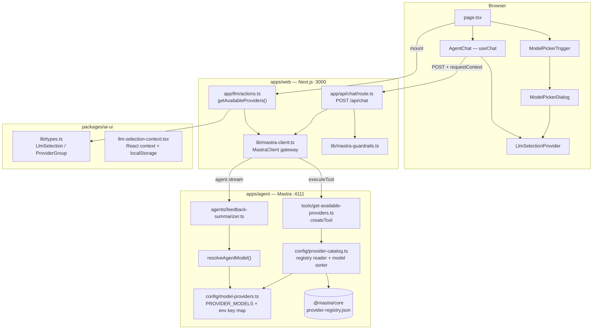
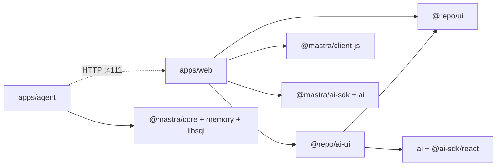

# Web → Mastra Connection & LLM Provider Selection

How `apps/web` (Next.js :3000) discovers, selects, and resolves LLM models through the `apps/agent` Mastra backend (:4111). This document is a reusable reference for adding new providers, understanding the data flow, and navigating the relevant code.

---

## Architecture Flow



---

## Two Approaches Side by Side

This project implements two complementary approaches. They serve different purposes and live in different layers.

| Approach | Role | What it does | Key files |
|----------|------|-------------|-----------|
| **Provider Discovery Tool** | UI-facing | Agent-side Mastra tool that reads the `@mastra/core` provider registry, checks which API keys are set, and returns a typed catalog of available providers + their models to the frontend model picker | `provider-catalog.ts`, `model-providers.ts`, `get-available-providers.ts`, `actions.ts` |
| **Runtime Model Resolution** | Engine-facing | A function `resolveAgentModel()` that decides which model string to use for each request, checked in this priority: `requestContext.llmModel` → `llmProvider` → `LLM_AGENT_MODEL` env var → `PROVIDER_MODELS[LLM_PROVIDER]` → hardcoded fallback | `model-providers.ts` |

They connect via the **model picker UI** — when a user selects a model, the frontend stores it in `LlmSelectionProvider` (backed by `localStorage`), then injects it as `requestContext: { llmModel, llmProvider }` into every chat API call. The agent's `resolveAgentModel()` reads that context and picks the correct model.

---

## Model Resolution Priority

`resolveAgentModel()` in `apps/agent/src/mastra/config/model-providers.ts:67-81` follows this order:

```
requestContext.get("llmModel")         ← Web model picker (per-request, highest priority)
        │
        ▼  (if not set or invalid)
requestContext.get("llmProvider")      ← Web provider picker (per-request)
        │
        ▼  (if not set or invalid)
process.env.LLM_AGENT_MODEL            ← Server env override
        │
        ▼  (if not set)
PROVIDER_MODELS[LLM_PROVIDER].agent    ← From LLM_PROVIDER env var
        │
        ▼  (if LLM_PROVIDER not set)
"openai/gpt-5.2"                       ← Hardcoded fallback
```

---

## Folder Structure (Relevant Files Only)

```
aria/
├── apps/
│   ├── agent/                          # Mastra backend — owns model config + API keys
│   │   └── src/mastra/
│   │       ├── index.ts                # Mastra({ agents, tools, storage, ... })
│   │       ├── agents/
│   │       │   └── feedback-summarizer.ts   # Agent with tools + memory + resolveAgentModel()
│   │       ├── config/
│   │       │   ├── model-providers.ts       # ◎ PROVIDER_MODELS, PROVIDER_API_KEY_ENV,
│   │       │   │                                getActiveProvider(), resolveAgentModel()
│   │       │   └── provider-catalog.ts      # ◎ Reads @mastra/core registry JSON,
│   │       │                                     getConnectedProviders(), model sorting
│   │       └── tools/
│   │           └── get-available-providers.ts  # ◎ createTool → returns provider catalog
│   │
│   └── web/                            # Next.js frontend — owns gateway + server actions
│       ├── lib/
│       │   └── mastra-client.ts        # ● MastraClient gateway, streamAgentToAiSdk(),
│       │                                    fetchProviderCatalog()
│       ├── app/
│       │   ├── llm/
│       │   │   └── actions.ts          # ● getAvailableProviders() server action
│       │   ├── api/chat/
│       │   │   └── route.ts            # ● POST /api/chat → streamAgentToAiSdk()
│       │   └── page.tsx                # ● LlmSelectionProvider + ModelPickerTrigger + AgentChat
│       └── .env.local                  # MASTRA_API_URL=http://localhost:4111
│
└── packages/
    └── ai-ui/                          # Shared AI component library
        └── src/
            ├── lib/
            │   └── types.ts            # ◆ LlmSelection, ProviderGroup, PROVIDER_DISPLAY_NAMES,
            │                                  formatModelName()
            └── components/llm/
                ├── llm-selection-context.tsx  # ◆ React context + localStorage persistence
                ├── model-picker-dialog.tsx    # ◆ Provider/model picker dialog
                ├── model-picker-trigger.tsx   # ◆ Compact trigger button
                └── agent-chat.tsx             # ◆ useChat + DefaultChatTransport + requestContext
```

**Legend:** ◎ = Agent-side model config · ● = Web-side gateway/action · ◆ = Shared UI library

---

## How Each Approach Works

### 1. Provider Discovery Tool (`getAvailableProvidersTool`)

**Purpose:** Lets the UI know which LLM providers are configured and what models they offer.

**Flow:**
1. `page.tsx` mounts → calls `getAvailableProviders()` server action
2. Server action calls `fetchProviderCatalog()` in `mastra-client.ts`
3. `mastra-client.ts` calls `agent.executeTool("get-available-providers")` via `@mastra/client-js`
4. On the agent, `get-available-providers.ts` calls `getConnectedProviders()` + `getActiveProvider()`
5. `getConnectedProviders()` iterates `PROVIDER_MODELS` keys, checks if each provider's API key env var is set
6. For connected providers, `provider-catalog.ts` reads `@mastra/core`'s `provider-registry.json`, filters non-chat models, sorts newest-first, returns up to 8 models
7. Server action transforms the raw tool output into `ProviderGroup[]` (using `PROVIDER_DISPLAY_NAMES` + `formatModelName()` from `@repo/ai-ui`)
8. `ModelPickerTrigger` renders the grouped list; `LlmSelectionProvider` stores the user's choice

**Key insight:** The model list is **never hardcoded in the UI** — it's discovered dynamically from the agent. The frontend only knows the `ProviderGroup` shape.

### 2. Runtime Model Resolution (`resolveAgentModel()`)

**Purpose:** Decides which model string to use when the agent actually processes a message.

**Flow:**
1. User selects a model in the picker → `LlmSelectionProvider.setSelection()` stores it in React state + `localStorage`
2. `AgentChat` reads `useLlmSelection().selection` and includes it in `requestContext`:
   ```json
   { "llmModel": "groq/llama-3.3-70b-versatile", "llmProvider": "groq" }
   ```
3. `POST /api/chat` receives the body → `streamAgentToAiSdk()` passes `requestContext` to `agent.stream()`
4. Mastra agent invokes `resolveAgentModel({ requestContext })` which reads `requestContext.get("llmModel")`
5. If a valid model string is found, it's returned directly — otherwise it falls back through the priority chain

**Key insight:** The model can be overridden per-request, per-session (via localStorage), or per-server (via env vars), without restarting the agent.

---

## How to Add / Remove a Provider

### Add a New Provider

Only **3 edits** in the agent — no web-side changes needed.

#### Step 1 — Edit `apps/agent/src/mastra/config/model-providers.ts`

```diff
- export type LlmProvider = "openai" | "groq" | "nvidia" | "sarvam";
+ export type LlmProvider = "openai" | "groq" | "nvidia" | "sarvam" | "anthropic";

  export const PROVIDER_MODELS: Record<LlmProvider, ProviderModelConfig> = {
    // ... existing entries ...
+   anthropic: {
+     agent: "anthropic/claude-sonnet-5",
+     memory: "anthropic/claude-haiku-5",
+   },
  };

  export const PROVIDER_API_KEY_ENV: Record<LlmProvider, string> = {
    // ... existing entries ...
+   anthropic: "ANTHROPIC_API_KEY",
  };
```

#### Step 2 — (Optional) Add display name in `packages/ai-ui/src/lib/types.ts`

```diff
  export const PROVIDER_DISPLAY_NAMES: Record<string, string> = {
    openai: "OpenAI",
    groq: "Groq",
    nvidia: "NVIDIA",
    sarvam: "Sarvam",
+   anthropic: "Anthropic",
  };
```

Without this, the picker shows the raw key (`anthropic`) instead of a friendly name.

#### Step 3 — Add API key to `apps/agent/.env.local`

```
ANTHROPIC_API_KEY=sk-ant-...
```

#### Step 4 — Restart the agent

```bash
pnpm dev:agent
```

The provider appears in the model picker automatically — no web code changes needed.

### What if the Provider Is Not in Mastra's Built-in Registry?

If the provider is not listed in `@mastra/core/dist/provider-registry.json`, `provider-catalog.ts` still works — it falls back to returning just the two default models from `PROVIDER_MODELS`. The agent will still resolve and use those models.

To show a full model catalog for a custom/private provider, implement a **Custom Gateway** (see below).

### Remove a Provider

Remove the provider's entries from all three places in `model-providers.ts`:
1. Remove from `LlmProvider` type union
2. Remove from `PROVIDER_MODELS`
3. Remove from `PROVIDER_API_KEY_ENV`

---

## When to Use Custom Gateways

The **current approach** (manual provider config + registry reader) is sufficient for standard LLM providers already in Mastra's built-in registry (OpenAI, Groq, Anthropic, Google, NVIDIA, etc.).

Use a **Custom Gateway** (extending `MastraModelGateway` from `@mastra/core/llm`) when you need:

| Scenario | Current approach | Gateway approach |
|----------|-----------------|-----------------|
| Standard provider (OpenAI, Groq, etc.) | ✅ Just add to `PROVIDER_MODELS` | ❌ Overkill |
| Private / enterprise LLM endpoint | ❌ No URL to point to | ✅ `buildUrl()` points to your endpoint |
| Custom auth scheme | ❌ Only env-var API key | ✅ Custom `getApiKey()` with caching |
| OpenAI-compatible proxy | ❌ No way to change base URL | ✅ `resolveLanguageModel()` with `createOpenAICompatible()` |
| Dynamic provider discovery | ❌ Hardcoded list | ✅ `fetchProviders()` returns models dynamically |

Register a gateway on the Mastra instance in `apps/agent/src/mastra/index.ts`:

```typescript
import { Mastra } from '@mastra/core/mastra';

const mastra = new Mastra({
  gateways: {
    myPrivate: new MyPrivateGateway(),
  },
  agents: { feedbackSummarizer },
  // ...
});
```

Then reference models as `myPrivate/provider/model-id` in `PROVIDER_MODELS`.

---

## Import Boundaries

```
@repo/ai-ui (shared UI)
  ├── React components, hooks, types
  ├── Depends on: @repo/ui, @ai-sdk/react, ai
  └── Imported by: apps/web, any future app (apps/mobile, apps/admin)

apps/web (Next.js)
  ├── @mastra/client-js       ← Mastra HTTP client (server-side only)
  ├── @mastra/ai-sdk          ← Stream conversion (toAISdkStream)
  ├── ai                      ← createUIMessageStreamResponse
  └── @repo/ai-ui             ← Chat + model picker components
      └── @repo/ui            ← Button, Card, Dialog, etc.

apps/agent (Mastra)
  ├── @mastra/core            ← Agent, Mastra, createTool
  ├── @mastra/memory          ← Memory with observational memory
  ├── @mastra/libsql          ← Storage
  └── zod                     ← Tool input/output schemas
```

**Never import `@mastra/core` or `apps/agent` code from `apps/web` or `@repo/ai-ui`.**  
API keys stay in `apps/agent/.env.local` — the web app only knows `MASTRA_API_URL`.

---

## Dependency Map



---

## Quick Reference: Key Files and Their Responsibilities

| File | Package | What it does | Change when adding provider? |
|------|---------|-------------|------------------------------|
| `config/model-providers.ts` | `@repo/agent` | `LlmProvider` type, `PROVIDER_MODELS`, `PROVIDER_API_KEY_ENV`, `resolveAgentModel()` | **Yes** — add type, models, env key |
| `config/provider-catalog.ts` | `@repo/agent` | Reads `@mastra/core` registry, `getConnectedProviders()`, model sorting | No (auto-detects new provider models) |
| `tools/get-available-providers.ts` | `@repo/agent` | CreateTool wrapping `getConnectedProviders()` + `getActiveProvider()` | No |
| `agents/feedback-summarizer.ts` | `@repo/agent` | Agent instance with `model: resolveAgentModel`, tools, memory | No |
| `lib/types.ts` | `@repo/ai-ui` | `LlmSelection`, `ProviderGroup`, `PROVIDER_DISPLAY_NAMES`, `formatModelName()` | Optional (add display name) |
| `llm-selection-context.tsx` | `@repo/ai-ui` | React context + localStorage persistence | No |
| `model-picker-dialog.tsx` | `@repo/ai-ui` | Provider/model picker dialog | No |
| `model-picker-trigger.tsx` | `@repo/ai-ui` | Compact trigger button showing current selection | No |
| `agent-chat.tsx` | `@repo/ai-ui` | `useChat` wrapper injecting `requestContext` from selection | No |
| `lib/mastra-client.ts` | `web` | `MastraClient` gateway, `streamAgentToAiSdk()`, `fetchProviderCatalog()` | No |
| `app/llm/actions.ts` | `web` | `getAvailableProviders()` server action | No |
| `app/api/chat/route.ts` | `web` | POST handler, guardrails, stream conversion | No |
| `app/page.tsx` | `web` | Page composing `LlmSelectionProvider` + `ModelPickerTrigger` + `AgentChat` | No |

---

## Data Flow Summary

### Provider Discovery (on page load)

```
Browser → getAvailableProviders() [server action]
  → mastraClient.executeTool("get-available-providers")
    → getConnectedProviders() + getActiveProvider()
      → PROVIDER_MODELS keys + PROVIDER_API_KEY_ENV checks
      → provider-catalog.ts reads registry.json for model list
    ← { providers: [{ provider, connected, models }], activeProvider }
  ← transformToProviderGroups(ProviderGroup[])
← ModelPicker renders, user picks → LlmSelectionProvider stores
```

### Chat with Model Selection (on each message)

```
User types → AgentChat
  → useChat(api="/api/chat")
    → prepareSendMessagesRequest({ requestContext: { llmModel, llmProvider } })
    → POST /api/chat { messages, agentId, memory, requestContext }
      → normalizeChatRequest() → runInputGuardrails()
      → streamAgentToAiSdk()
        → mastraClient.getAgent(agentId).stream(messages, { requestContext })
          → feedbackSummarizer agent
            → resolveAgentModel({ requestContext })
              → reads llmModel → returns "groq/llama-3.3-70b-versatile"
            → agent streams with selected model
          ← Mastra native data stream
        → toAISdkStream() → guardrail transform
      ← AI SDK UI stream
    ← Response
  ← Renders tokens in real-time
```
