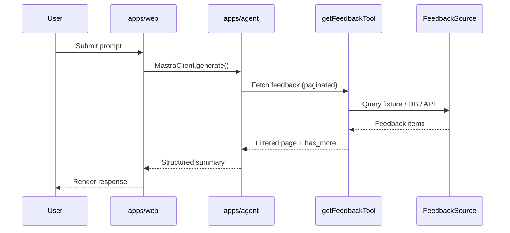

# Architecture: Customer Feedback Summarization

Feature-specific design. Platform-level Mastra decisions are in [ai-platform.md](../../architecture/ai-platform.md).

## Data flow



## Agent behavior

The `feedbackSummarizer` agent:

1. Calls `getFeedbackTool` with optional filters (`source`, `customer_tier`, dates)
2. Paginates when `has_more` is true
3. Categorizes items (bug, feature request, praise, complaint, question)
4. Outputs: Overview, Key Findings, Critical Issues, Recommendations
5. Uses observational memory to compare trends across sessions

## Tool: get-feedback

| Input | Type | Purpose |
|-------|------|---------|
| `source` | enum | `support_ticket`, `app_review`, `survey`, `social_media` |
| `customer_tier` | enum | `free`, `pro`, `enterprise` |
| `start_date` / `end_date` | string | Date range filter |
| `limit` / `offset` | number | Pagination |

**Default data:** static fixture in `src/mastra/data/`. Replace `execute` in `get-feedback.ts` for production.

## Web integration (planned)

### Recommended: Server Action or Route Handler

```
apps/web/
├── lib/
│   └── mastra-client.ts      # MastraClient singleton (server-only)
├── app/
│   └── feedback/
│       ├── page.tsx          # UI
│       └── actions.ts        # "use server" → agent.generate()
```

### Why server-side

- Hides `MASTRA_API_URL` and avoids exposing agent endpoints to browser
- Allows session/auth checks before calling the agent
- Matches Next.js + Mastra [separate backend pattern](https://mastra.ai/blog/nextjs-integration-guide)

### Agent ID

Use `feedbackSummarizer` when calling `client.getAgent("feedbackSummarizer")`.

## Storage and memory

| Layer | Implementation | Scope |
|-------|----------------|-------|
| Session memory | `@mastra/memory` | Last 20 messages + observational memory |
| Persistence | `@mastra/libsql` | `file:./mastra.db` in agent app |
| Observability | `@mastra/observability` | Traces, sensitive data filter |

## Future extensions

Document new sub-features as sections here or split into `docs/features/<sub-feature>/` if they grow large (e.g. real-time feedback ingestion, admin dashboard).

## Related

- [Implementation plan](./implementation-plan.md)
- [Commands](./commands.md)
